# 2026+ Literature on Optimizing VLA-Based Robot Learning, Planning, Deployment, Data, and Safety

## Executive summary

- 2026 (so far) shows a clear shift from “bigger end-to-end VLAs” toward **systems engineering of latency, control rate, and modularity**—dynamic layer skipping, selective perception / view routing, and compact “latent reasoning” that reduces inference overhead while keeping long-horizon competence. citeturn11view1turn18view0turn14view0turn11view2  
- **World-model integration becomes more geometric and more actionable**: point-flow 3D world models for MPC, image-goal synthesis for hierarchical execution, and digital-twin pipelines (Gaussian splatting → collision geometry) are prominent “Type III” responses to world-state fidelity and sim-to-real. citeturn29view0turn30view0turn32view0turn31view0  
- Data work in early 2026 emphasizes **scaling laws and alternative supervision**: large egocentric human video is used to derive predictable scaling behavior for dexterous manipulation and to reduce dependence on expensive robot teleop. citeturn36view0turn40view0  
- Multi-sensory embodiment is moving from “tactile as extra observation” to **architectural adapters / MoE fusion** that explicitly control how force/tactile enters the policy, paired with purpose-built datasets. citeturn21view0turn20view0turn38view0turn22view0  
- Safety researchers in 2026 increasingly treat foundation-model robots as a **full-stack safety** problem: guardrail architectures, security threats (backdoors), and interpretability / internal-trace vulnerabilities (CoT as an attack surface) all appear as first-class topics. citeturn41view0turn44view0turn45view0turn46view0turn47view0  

Most influential (2026+) works in this snapshot (selected for breadth + likely downstream impact): **PointWorld** citeturn29view0, **InternVLA-A1** citeturn13view0, **Cosmos Policy** citeturn40view0, **LiLo-VLA** citeturn12view0, **LaST₀** citeturn11view2, **Fast-ThinkAct** citeturn14view0, **DySL-VLA** citeturn11view1, **EgoScale** citeturn36view0, **MobileManiBench** citeturn33view0, **Modular Safety Guardrails** citeturn41view0.

## Table of selected 2026+ works

| citation key | year | title | targeted directions | one-line contribution |
|---|---:|---|---|---|
| liu2026activevla | 2026 | ActiveVLA | Type I; embodiment | Active perception + 3D zoom/view selection for precise manipulation |
| yang2026dyslvla | 2026 | DySL-VLA | Type I; deployment | Dynamic-static layer skipping to cut compute while preserving success |
| xie2026dynamicvla | 2026 | DynamicVLA | Type I; deployment; evaluation/data | Low-latency VLA for dynamic objects + DOM benchmark and auto data pipeline |
| cai2026internvlaa1 | 2026 | InternVLA-A1 | Type I; Type III; data | Mixture-of-Transformers unifying understanding, foresight, and action |
| wu2026lingbotvla | 2026 | A Pragmatic VLA Foundation Model (LingBot-VLA) | Type I; deployment; data | “Cost-efficient” VLA + large real dual-arm data + faster training stack |
| kim2026cosmospolicy | 2026 | Cosmos Policy | Type I/III; policy paradigms | Fine-tune a video diffusion model into a policy + test-time planning |
| son2026selectiveperception | 2026 | Selective Perception for Robot | Type I; deployment | Task-aware multi-view routing to reduce compute and noise |
| liu2026last0 | 2026 | LaST₀ | Type II; deployment | Latent spatiotemporal CoT with dual-rate reasoning/acting experts |
| huang2026fastthinkact | 2026 | Fast-ThinkAct | Type II; deployment | Distilled latent planning to reduce CoT latency with strong performance |
| zhong2026acotvla | 2026 | ACoT-VLA | Type II; planning | “Action chain-of-thought”: reason directly in action space |
| tan2026actionsketcher | 2026 | Action-Sketcher | Type II; interpretability | Visual sketch intermediate for grounded long-horizon plans + editability |
| yang2026lilovla | 2026 | LiLo-VLA | Type II; planning | Object-centric modular skills + robust linking for compositional long-horizon |
| long2026scalingwm | 2026 | Scaling World Model for Hierarchical Manipulation Policies (VISTA) | Type II/III; planning | World model generates goal images for OOD-robust hierarchical execution |
| huang2026pointworld | 2026 | PointWorld | Type III; embodiment; data | 3D point-flow world model enabling real-time MPC across embodiments |
| sun2026digitaltwin3dgs | 2026 | High-Fidelity Digital Twin via 3DGS | Type III; deployment | Minutes-to-digital-twin + collision geometry for real robot planning |
| li2026explicitwm | 2026 | Explicit World Model for Zero-Shot Open-World Manipulation | Type III; planning | Digital twin + open-set perception + strategy sampling for zero-shot tasks |
| yuan2026adaworldpolicy | 2026 | AdaWorldPolicy | Type III; policy paradigms | World-model-driven diffusion + online adaptive learning + force feedback |
| yang2026remapdp | 2026 | ReMAP-DP | Type I/III; representation | Multi-view reprojection + PointMaps for 3D-aware diffusion policies |
| xie2026forediffusion | 2026 | ForeDiffusion | policy paradigms | Future-view-conditioned diffusion + dual loss to reduce drift |
| gui2026seedpolicy | 2026 | SeedPolicy | policy paradigms | Recurrent “self-evolving” temporal compression for longer horizons |
| yi2026flowpg | 2026 | Flow Policy Gradients | policy paradigms | Likelihood-free flow-matching PG for expressive reward-trained control |
| welte2026flowcorrect | 2026 | FlowCorrect | system coupling; deployment | Deployment-time human corrections for flow policies without retraining |
| wang2026mobilemanibench | 2026 | MobileManiBench | evaluation; data infrastructure | Simulation-first model verification benchmark for mobile manipulation |
| li2026deco | 2026 | DECO | embodiment; data | Decoupled multimodal diffusion + plugin tactile adapter + DECO-50 dataset |
| sun2026demuse | 2026 | DeMUSE | embodiment; policy paradigms | Diffusion Transformer + sparse experts to fuse RGB/depth/force in real time |
| wang2026admdp | 2026 | ADM-DP | embodiment; policy paradigms | Vision–tactile–graph fusion diffusion policy for multi-agent manipulation |
| tang2026modevla | 2026 | RL-Augmented Teleop + MoDE-VLA | embodiment; data | Shared-autonomy teleop + residual tactile/force injection for dexterity |
| li2026unibidex | 2026 | UniBiDex | data infrastructure; embodiment | Open teleop framework for bimanual dexterous demos with safety guarantees |
| zheng2026egoscale | 2026 | EgoScale | data infrastructure; embodiment | Human-video scaling law + two-stage transfer to dexterous robot hands |
| liu2026roco | 2026 | RoCo Challenge at AAAI 2026 | evaluation; deployment | Industrial assembly benchmark with sim + real phases and datasets |
| chen2026roborouter | 2026 | RoboRouter | system coupling | Training-free routing among heterogeneous policies using execution history |
| kim2026guardrails | 2026 | Modular Safety Guardrails | safety; system coupling | Non-bypassable monitoring + intervention layers for FM-enabled robots |
| li2026bera | 2026 | When Attention Betrays (Bera) | safety | Test-time backdoor erasure via token localization + reconstruction |
| huang2026dgba | 2026 | Diffusion-Guided Backdoor Attacks (DGBA) | safety | Physical triggers + diffusion-generated patches for real-world RL backdoors |
| trinh2026alteredthoughts | 2026 | Altered Thoughts, Altered Actions | safety/interpretability | CoT corruption study: decoders rely on entity grounding, not “reasoning” |
| buurmeijer2026observing | 2026 | Observing & Controlling Features in VLAs | interpretability; safety | Linear observability + lightweight control interventions to steer behavior |

## Annotated bibliography by paper

Below each entry includes (1) BibTeX, (2) 2–3 sentence contribution summary tied to your survey’s optimization directions, (3) targeted direction tags, and (4) limitations / open questions.

**liu2026activevla — ActiveVLA: Injecting Active Perception into Vision-Language-Action Models for Precise 3D Robotic Manipulation (2026).** citeturn11view0  
Targets: Type I unification vs execution; embodiment.  
Summary: ActiveVLA explicitly injects *active perception* into VLA manipulation through a coarse-to-fine pipeline: it localizes critical 3D regions using multi-view projections, then selects views and performs 3D zoom-in to reduce occlusion and increase precision. This directly optimizes the perception–action loop for contact-sensitive or cluttered settings where static wrist views are limiting.  
Limitations/open questions: View selection adds a control/design layer that may be environment- and sensor-specific; robustness under fast dynamics and severe occlusion remains an open edge case. citeturn11view0  
```bibtex
@misc{liu2026activevla,
  title={ActiveVLA: Injecting Active Perception into Vision-Language-Action Models for Precise 3D Robotic Manipulation},
  author={Zhenyang Liu and Yongchong Gu and Yikai Wang and Xiangyang Xue and Yanwei Fu},
  year={2026},
  eprint={2601.08325},
  archivePrefix={arXiv},
  primaryClass={cs.RO},
  doi={10.48550/arXiv.2601.08325},
  url={https://arxiv.org/abs/2601.08325}
}
```

**yang2026dyslvla — DySL-VLA: Efficient Vision-Language-Action Model Inference via Dynamic-Static Layer-Skipping for Robot Manipulation (2026).** citeturn11view1  
Targets: Type I unification vs execution; system coupling/deployment/evaluation.  
Summary: DySL-VLA reframes VLA inference as “importance-aware compute”, splitting layers into always-on informative layers and skippable incremental layers, then learning when to skip via a guidance mechanism plus distillation. It reports large parameter and latency reductions (while improving success length on CALVIN) to better meet real-time constraints. citeturn11view1  
Limitations/open questions: Dynamic skipping policies may be brittle under distribution shift (importance estimation itself can fail), and hardware-dependent speedups can vary with deployment stacks. citeturn11view1  
```bibtex
@misc{yang2026dyslvla,
  title={DySL-VLA: Efficient Vision-Language-Action Model Inference via Dynamic-Static Layer-Skipping for Robot Manipulation},
  author={Zebin Yang and Yijiahao Qi and Tong Xie and Bo Yu and Shaoshan Liu and Meng Li},
  year={2026},
  eprint={2602.22896},
  archivePrefix={arXiv},
  primaryClass={cs.RO},
  doi={10.48550/arXiv.2602.22896},
  url={https://arxiv.org/abs/2602.22896}
}
```

**xie2026dynamicvla — DynamicVLA: A Vision-Language-Action Model for Dynamic Object Manipulation (2026).** citeturn17view0  
Targets: Type I unification vs execution; system coupling/deployment/evaluation; data support/infrastructure.  
Summary: DynamicVLA focuses on *dynamic objects* by combining a compact architecture with “continuous inference” (overlapping reasoning and execution) and “latent-aware action streaming” for low latency. It also introduces a Dynamic Object Manipulation (DOM) benchmark with a large synthetic pipeline and a non-teleop real data collection path, directly targeting evaluation/data bottlenecks in dynamic settings. citeturn17view0  
Limitations/open questions: The gap between benchmarked dynamics and open-world dynamics (unmodeled physics, contact) remains, and the generality across embodiments hinges on action streaming interfaces. citeturn17view0  
```bibtex
@misc{xie2026dynamicvla,
  title={DynamicVLA: A Vision-Language-Action Model for Dynamic Object Manipulation},
  author={Haozhe Xie and Beichen Wen and Jiarui Zheng and Zhaoxi Chen and Fangzhou Hong and Haiwen Diao and Ziwei Liu},
  year={2026},
  eprint={2601.22153},
  archivePrefix={arXiv},
  primaryClass={cs.RO},
  doi={10.48550/arXiv.2601.22153},
  url={https://arxiv.org/abs/2601.22153}
}
```

**cai2026internvlaa1 — InternVLA-A1: Unifying Understanding, Generation and Action for Robotic Manipulation (2026).** citeturn13view0  
Targets: Type I unification vs execution; Type III world-state fidelity; data support/infrastructure.  
Summary: InternVLA-A1 uses a unified Mixture-of-Transformers architecture with three experts for scene understanding, visual foresight generation, and action execution, aiming to merge semantic grounding with predictive dynamics. It emphasizes heterogeneous pretraining over robot data, simulation, and human videos at large scale, positioning “foresight” as a first-class capability inside the VLA. citeturn13view0  
Limitations/open questions: Multi-expert coordination can hide failure modes (e.g., foresight error cascading into control), and the approach depends on large, carefully mixed datasets that may be hard to reproduce. citeturn13view0  
```bibtex
@misc{cai2026internvlaa1,
  title={InternVLA-A1: Unifying Understanding, Generation and Action for Robotic Manipulation},
  author={Junhao Cai and Zetao Cai and Jiafei Cao and Yilun Chen and Zeyu He and Lei Jiang and Hang Li and Hengjie Li and Yang Li and Yufei Liu and Yanan Lu and Qi Lv and Haoxiang Ma and Jiangmiao Pang and Yu Qiao and Zherui Qiu and Yanqing Shen and Xu Shi and Yang Tian and Bolun Wang and Hanqing Wang and Jiaheng Wang and Tai Wang and Xueyuan Wei and Chao Wu and Yiman Xie and Boyang Xing and Yuqiang Yang and Yuyin Yang and Qiaojun Yu and Feng Yuan and Jia Zeng and Jingjing Zhang and Shenghan Zhang and Shi Zhang and Zhuoma Zhaxi and Bowen Zhou and Yuanzhen Zhou and Yunsong Zhou and Hongrui Zhu and Yangkun Zhu and Yuchen Zhu},
  year={2026},
  eprint={2601.02456},
  archivePrefix={arXiv},
  primaryClass={cs.RO},
  doi={10.48550/arXiv.2601.02456},
  url={https://arxiv.org/abs/2601.02456}
}
```

**wu2026lingbotvla — A Pragmatic VLA Foundation Model (LingBot-VLA) (2026).** citeturn39view0  
Targets: Type I unification vs execution; system coupling/deployment/evaluation; data support.  
Summary: LingBot-VLA explicitly frames success as *generalization + cost efficiency*—it reports training throughput improvements and broad platform/task assessment, backed by ~20,000 hours across multiple dual-arm configurations. This is an optimization-oriented “engineering” contribution: model + codebase + benchmarks for reproducible adaptation. citeturn39view0  
Limitations/open questions: The approach’s practical value depends on access to similar multi-platform data; transfer to smaller labs can be limited by hardware and data availability. citeturn39view0  
```bibtex
@misc{wu2026lingbotvla,
  title={A Pragmatic VLA Foundation Model},
  author={Wei Wu and Fan Lu and Yunnan Wang and Shuai Yang and Shi Liu and Fangjing Wang and Qian Zhu and He Sun and Yong Wang and Shuailei Ma and Yiyu Ren and Kejia Zhang and Hui Yu and Jingmei Zhao and Shuai Zhou and Zhenqi Qiu and Houlong Xiong and Ziyu Wang and Zechen Wang and Ran Cheng and Yong-Lu Li and Yongtao Huang and Xing Zhu and Yujun Shen and Kecheng Zheng},
  year={2026},
  eprint={2601.18692},
  archivePrefix={arXiv},
  primaryClass={cs.RO},
  doi={10.48550/arXiv.2601.18692},
  url={https://arxiv.org/abs/2601.18692}
}
```

**kim2026cosmospolicy — Cosmos Policy: Fine-Tuning Video Models for Visuomotor Control and Planning (2026).** citeturn40view0  
Targets: Type III world-state fidelity; policy learning paradigms; system coupling/deployment.  
Summary: Cosmos Policy proposes a single-stage post-training method to adapt a pretrained video generation model into a policy, encoding actions as latent “frames” inside a latent diffusion process, and additionally predicting future state images and values for test-time planning. It is a principled bridge between video world models and visuomotor control that reduces architectural “glue code”. citeturn40view0  
Limitations/open questions: Success depends on the pretrained video model’s coverage of relevant physics; long-horizon planning risks compounding prediction errors without robust correction. citeturn40view0  
```bibtex
@misc{kim2026cosmospolicy,
  title={Cosmos Policy: Fine-Tuning Video Models for Visuomotor Control and Planning},
  author={Moo Jin Kim and Yihuai Gao and Tsung-Yi Lin and Yen-Chen Lin and Yunhao Ge and Grace Lam and Percy Liang and Shuran Song and Ming-Yu Liu and Chelsea Finn and Jinwei Gu},
  year={2026},
  eprint={2601.16163},
  archivePrefix={arXiv},
  primaryClass={cs.AI},
  doi={10.48550/arXiv.2601.16163},
  url={https://arxiv.org/abs/2601.16163}
}
```

**son2026selectiveperception — Selective Perception for Robot: Task-Aware Attention in Multimodal VLA (2026).** citeturn18view0  
Targets: Type I unification vs execution; system coupling/deployment/evaluation; embodiment.  
Summary: This work adds a lightweight routing module that predicts task relevance of multiple camera views and selectively feeds essential features to the policy, improving efficiency and robustness under background noise. It also proposes an automated labeling pipeline using VLMs to reduce data/annotation cost for training the router. citeturn18view0  
Limitations/open questions: Routing errors can suppress critical information; guarantees about worst-case failures under rare-but-critical viewpoints remain open. citeturn18view0  
```bibtex
@misc{son2026selectiveperception,
  title={Selective Perception for Robot: Task-Aware Attention in Multimodal VLA},
  author={Young-Chae Son and Jung-Woo Lee and Yoon-Ji Choi and Dae-Kwan Ko and Soo-Chul Lim},
  year={2026},
  eprint={2602.15543},
  archivePrefix={arXiv},
  primaryClass={cs.RO},
  doi={10.48550/arXiv.2602.15543},
  url={https://arxiv.org/abs/2602.15543}
}
```

**liu2026last0 — LaST₀: Latent Spatio-Temporal Chain-of-Thought for Robotic VLA (2026).** citeturn11view2  
Targets: Type II intermediate representation; Type I↔II boundary (temporal decoupling); system coupling/deployment.  
Summary: LaST₀ addresses the “CoT latency tax” by moving reasoning into a token-efficient latent space that captures future dynamics, 3D structure, and proprioception, then executing with a dual-system Mixture-of-Transformers (low-frequency reasoning expert + high-frequency acting expert). This directly targets the mismatch between semantic reasoning timescales and motor control rates. citeturn11view2  
Limitations/open questions: Latent reasoning is harder to audit; whether latent-CoT generalizes to unseen physical edge cases without explicit supervision is unresolved. citeturn11view2  
```bibtex
@misc{liu2026last0,
  title={LaST$_0$: Latent Spatio-Temporal Chain-of-Thought for Robotic Vision-Language-Action Model},
  author={Zhuoyang Liu and Jiaming Liu and Hao Chen and Jiale Yu and Ziyu Guo and Chengkai Hou and Chenyang Gu and Xiangju Mi and Renrui Zhang and Kun Wu and Zhengping Che and Jian Tang and Pheng-Ann Heng and Shanghang Zhang},
  year={2026},
  eprint={2601.05248},
  archivePrefix={arXiv},
  primaryClass={cs.RO},
  doi={10.48550/arXiv.2601.05248},
  url={https://arxiv.org/abs/2601.05248}
}
```

**huang2026fastthinkact — Fast-ThinkAct: Efficient VLA Reasoning via Verbalizable Latent Planning (2026).** citeturn14view0  
Targets: Type II intermediate representation; system coupling/deployment/evaluation.  
Summary: Fast-ThinkAct distills “teacher” reasoning into compact latent-CoTs aligned to manipulation trajectories, reporting large inference-latency reductions while preserving long-horizon planning and recovery. It is an explicit optimization of the reasoning-depth ↔ latency trade-off outlined in Type II designs. citeturn14view0  
Limitations/open questions: Distillation quality is bounded by teacher behavior; latent planning may inherit teacher biases and be difficult to debug when failures occur. citeturn14view0  
```bibtex
@misc{huang2026fastthinkact,
  title={Fast-ThinkAct: Efficient Vision-Language-Action Reasoning via Verbalizable Latent Planning},
  author={Chi-Pin Huang and Yunze Man and Zhiding Yu and Min-Hung Chen and Jan Kautz and Yu-Chiang Frank Wang and Fu-En Yang},
  year={2026},
  eprint={2601.09708},
  archivePrefix={arXiv},
  primaryClass={cs.CV},
  doi={10.48550/arXiv.2601.09708},
  url={https://arxiv.org/abs/2601.09708}
}
```

**zhong2026acotvla — ACoT-VLA: Action Chain-of-Thought for Vision-Language-Action Models (2026).** citeturn15view0  
Targets: Type II intermediate representation; cognitive planning paradigms (action-level reasoning).  
Summary: ACoT-VLA argues that intermediate reasoning should live in **action space**, not only in language or images: it builds an Explicit Action Reasoner proposing coarse reference trajectories plus an Implicit Action Reasoner extracting latent action priors to condition the action head. This is a direct architectural answer to “what intermediate representation should Type II use?” when precision matters. citeturn15view0  
Limitations/open questions: Coarse action intents may still be too low-level for complex task logic; robustness to contact-rich perturbations depends on downstream controllers. citeturn15view0  
```bibtex
@misc{zhong2026acotvla,
  title={ACoT-VLA: Action Chain-of-Thought for Vision-Language-Action Models},
  author={Linqing Zhong and Yi Liu and Yifei Wei and Ziyu Xiong and Maoqing Yao and Si Liu and Guanghui Ren},
  year={2026},
  eprint={2601.11404},
  archivePrefix={arXiv},
  primaryClass={cs.RO},
  doi={10.48550/arXiv.2601.11404},
  url={https://arxiv.org/abs/2601.11404}
}
```

**tan2026actionsketcher — Action-Sketcher: From Reasoning to Action via Visual Sketches for Long-Horizon Manipulation (2026).** citeturn16view0  
Targets: Type II intermediate representation; safety/interpretability; system coupling/deployment.  
Summary: Action-Sketcher externalizes intent as an editable **visual sketch** (points/boxes/arrows/relations) rendered in current views, then runs a cyclic see–think–sketch–act loop with token-gated triggers for revisions and action issuance. This tackles grounding and interpretability while maintaining real-time action prediction via structured intermediates. citeturn16view0  
Limitations/open questions: Sketch supervision and toolchains add complexity; whether sketches remain robust under severe partial observability and latency-constrained deployment is open. citeturn16view0  
```bibtex
@misc{tan2026actionsketcher,
  title={Action-Sketcher: From Reasoning to Action via Visual Sketches for Long-Horizon Robotic Manipulation},
  author={Huajie Tan and Peterson Co and Yijie Xu and Shanyu Rong and Yuheng Ji and Cheng Chi and Xiansheng Chen and Qiongyu Zhang and Zhongxia Zhao and Pengwei Wang and Zhongyuan Wang and Shanghang Zhang},
  year={2026},
  eprint={2601.01618},
  archivePrefix={arXiv},
  primaryClass={cs.RO},
  doi={10.48550/arXiv.2601.01618},
  url={https://arxiv.org/abs/2601.01618}
}
```

**yang2026lilovla — LiLo-VLA: Compositional Long-Horizon Manipulation via Linked Object-Centric Policies (2026).** citeturn12view0  
Targets: Type II intermediate representation; cognitive planning paradigms; system coupling/failure recovery.  
Summary: LiLo-VLA decomposes long-horizon tasks into transport vs interaction, using object-centric VLAs for robust interaction and a reaching module for global motion, enabling zero-shot compositionality and replanning. It targets cascading failures typical of monolithic policies by making linkage and recovery explicit. citeturn12view0  
Limitations/open questions: The decomposition presumes tasks factor cleanly into reaching + local interaction; highly coupled multi-object dynamics may violate this assumption. citeturn12view0  
```bibtex
@misc{yang2026lilovla,
  title={LiLo-VLA: Compositional Long-Horizon Manipulation via Linked Object-Centric Policies},
  author={Yue Yang and Shuo Cheng and Yu Fang and Homanga Bharadhwaj and Mingyu Ding and Gedas Bertasius and Daniel Szafir},
  year={2026},
  eprint={2602.21531},
  archivePrefix={arXiv},
  primaryClass={cs.RO},
  doi={10.48550/arXiv.2602.21531},
  url={https://arxiv.org/abs/2602.21531}
}
```

**long2026scalingwm — Scaling World Model for Hierarchical Manipulation Policies (VISTA) (2026).** citeturn30view0  
Targets: Type II intermediate representation; Type III world-state fidelity; cognitive planning B1–B5 (goal synthesis).  
Summary: This paper positions a large pretrained world model as a high-level planner that decomposes tasks into subgoals by synthesizing *goal images*, which then guide a low-level VLA executor. It reports large OOD improvements, arguing that visually grounded subgoals carry physically meaningful constraints that text-only goals miss. citeturn30view0  
Limitations/open questions: Goal image quality is a bottleneck—if the world model hallucinates or drifts, the executor may be guided into infeasible states; maintaining temporal consistency under dynamic changes remains unresolved. citeturn30view0  
```bibtex
@misc{long2026scalingwm,
  title={Scaling World Model for Hierarchical Manipulation Policies},
  author={Qian Long and Yueze Wang and Jiaxi Song and Junbo Zhang and Peiyan Li and Wenxuan Wang and Yuqi Wang and Haoyang Li and Shaoxuan Xie and Guocai Yao and Hanbo Zhang and Xinlong Wang and Zhongyuan Wang and Xuguang Lan and Huaping Liu and Xinghang Li},
  year={2026},
  eprint={2602.10983},
  archivePrefix={arXiv},
  primaryClass={cs.RO},
  doi={10.48550/arXiv.2602.10983},
  url={https://arxiv.org/abs/2602.10983}
}
```

**huang2026pointworld — PointWorld: Scaling 3D World Models for In-The-Wild Robotic Manipulation (2026).** citeturn29view0  
Targets: Type III world-state fidelity; embodiment; policy+planning integration.  
Summary: PointWorld unifies state and action in 3D as point flows, forecasting per-pixel 3D displacements conditioned on action sequences, and is designed to integrate into MPC at real-time inference speeds. Its action-as-3D-flow framing directly targets cross-embodiment transfer by avoiding embodiment-specific action parameterizations. citeturn29view0  
Limitations/open questions: “Forecast then MPC” pipelines remain sensitive to partial observability and contact discontinuities; verifying reliability for safety-critical deployment is still open. citeturn29view0  
```bibtex
@misc{huang2026pointworld,
  title={PointWorld: Scaling 3D World Models for In-The-Wild Robotic Manipulation},
  author={Wenlong Huang and Yu-Wei Chao and Arsalan Mousavian and Ming-Yu Liu and Dieter Fox and Kaichun Mo and Li Fei-Fei},
  year={2026},
  eprint={2601.03782},
  archivePrefix={arXiv},
  primaryClass={cs.RO},
  doi={10.48550/arXiv.2601.03782},
  url={https://arxiv.org/abs/2601.03782}
}
```

**sun2026digitaltwin3dgs — A High-Fidelity Digital Twin for Robotic Manipulation Based on 3D Gaussian Splatting (2026).** citeturn32view0  
Targets: Type III world-state fidelity; system coupling/deployment/evaluation.  
Summary: This framework builds photorealistic digital twins from sparse RGB using 3D Gaussian Splatting, adds visibility-aware semantic fusion, and converts the representation into collision-ready geometry for a planning stack. It directly targets the “planning-ready world state” gap between neural reconstructions and classical motion planning requirements. citeturn32view0  
Limitations/open questions: Collision geometry conversion can lose fine contact detail; updating the twin under rapid scene changes remains a difficult online problem. citeturn32view0  
```bibtex
@misc{sun2026digitaltwin3dgs,
  title={A High-Fidelity Digital Twin for Robotic Manipulation Based on 3D Gaussian Splatting},
  author={Ziyang Sun and Lingfan Bao and Tianhu Peng and Jingcheng Sun and Chengxu Zhou},
  year={2026},
  eprint={2601.03200},
  archivePrefix={arXiv},
  primaryClass={cs.RO},
  doi={10.48550/arXiv.2601.03200},
  url={https://arxiv.org/abs/2601.03200}
}
```

**li2026explicitwm — Building Explicit World Model for Zero-Shot Open-World Object Manipulation (2026).** citeturn31view0  
Targets: Type III world-state fidelity; cognitive planning; deployment.  
Summary: The paper proposes a fully explicit world-model pipeline: open-set perception + digital-twin reconstruction + sampling/evaluation of interaction strategies in a physics simulator, then execute the chosen strategy in the real world—without task-specific action demonstrations. This is a direct “Type III” alternative to end-to-end VLAs for open-world generalization. citeturn31view0  
Limitations/open questions: Strategy search can be expensive; performance depends on simulator fidelity and perception robustness, especially for deformables and heavy occlusion. citeturn31view0  
```bibtex
@misc{li2026explicitwm,
  title={Building Explicit World Model for Zero-Shot Open-World Object Manipulation},
  author={Xiaotong Li and Gang Chen and Javier Alonso-Mora},
  year={2026},
  eprint={2603.13825},
  archivePrefix={arXiv},
  primaryClass={cs.RO},
  doi={10.48550/arXiv.2603.13825},
  url={https://arxiv.org/abs/2603.13825}
}
```

**yuan2026adaworldpolicy — AdaWorldPolicy: World-Model-Driven Diffusion Policy with Online Adaptive Learning (2026).** citeturn28view0  
Targets: Type III world-state fidelity; policy learning paradigms; deployment-time adaptation.  
Summary: AdaWorldPolicy integrates a world model, action expert, and force predictor as flow-matching diffusion transformers with multimodal attention for feature exchange, then alternates between action generation and “future imagination” to enable online adaptation. It explicitly aims to adapt under both visual and physical shifts with minimal overhead. citeturn28view0  
Limitations/open questions: Online adaptation risks destabilizing behavior without safeguards; balancing when to “imagine” vs “act” remains a sensitive policy design choice. citeturn28view0  
```bibtex
@misc{yuan2026adaworldpolicy,
  title={AdaWorldPolicy: World-Model-Driven Diffusion Policy with Online Adaptive Learning for Robotic Manipulation},
  author={Ge Yuan and Qiyuan Qiao and Jing Zhang and Dong Xu},
  year={2026},
  eprint={2602.20057},
  archivePrefix={arXiv},
  primaryClass={cs.RO},
  doi={10.48550/arXiv.2602.20057},
  url={https://arxiv.org/abs/2602.20057}
}
```

**yang2026remapdp — ReMAP-DP: Reprojected Multi-view Aligned PointMaps for Diffusion Policy (2026).** citeturn27view0  
Targets: Type I unification vs execution; Type III world-state fidelity; representation/architectural trade-offs.  
Summary: ReMAP-DP aims to preserve VLM-like semantics while adding explicit geometry, using standardized perspective reprojection plus pixel-aligned PointMaps in a dual-stream diffusion policy with alignment-oriented fusion. It targets the “2D semantic vs 3D precision” trade-off typical of contact-rich tasks. citeturn27view0  
Limitations/open questions: Multi-view calibration and reprojection assumptions may break under shifting cameras and rolling shutter; robustness to real-world sensor noise is central. citeturn27view0  
```bibtex
@misc{yang2026remapdp,
  title={ReMAP-DP: Reprojected Multi-view Aligned PointMaps for Diffusion Policy},
  author={Xinzhang Yang and Renjun Wu and Jinyan Liu and Xuesong Li},
  year={2026},
  eprint={2603.14977},
  archivePrefix={arXiv},
  primaryClass={cs.RO},
  doi={10.48550/arXiv.2603.14977},
  url={https://arxiv.org/abs/2603.14977}
}
```

**xie2026forediffusion — ForeDiffusion: Foresight-Conditioned Diffusion Policy via Future View Construction (2026).** citeturn26view0  
Targets: policy learning paradigms; Type III (predictive conditioning).  
Summary: ForeDiffusion conditions diffusion on predicted future-view representations and adds a consistency loss on future observations, aiming to reduce error accumulation and correct drift in complex tasks. This is a “predict-then-act” improvement for iterative generative policies. citeturn26view0  
Limitations/open questions: Future-view prediction quality is a bottleneck; the method may degrade if foresight is systematically biased or uncertain. citeturn26view0  
```bibtex
@misc{xie2026forediffusion,
  title={ForeDiffusion: Foresight-Conditioned Diffusion Policy via Future View Construction for Robot Manipulation},
  author={Weize Xie and Yi Ding and Ying He and Leilei Wang and Binwen Bai and Zheyi Zhao and Chenyang Wang and F. Richard Yu},
  year={2026},
  eprint={2601.12925},
  archivePrefix={arXiv},
  primaryClass={cs.RO},
  doi={10.48550/arXiv.2601.12925},
  url={https://arxiv.org/abs/2601.12925}
}
```

**gui2026seedpolicy — SeedPolicy: Horizon Scaling via Self-Evolving Diffusion Policy (2026).** citeturn25view0  
Targets: policy learning paradigms; long-horizon execution.  
Summary: SeedPolicy introduces a recurrent “Self-Evolving Gated Attention” module that compresses long observation horizons into a fixed-size latent state, countering diffusion policy degradation with longer contexts. It directly targets temporal scaling without needing VLA-scale parameters. citeturn25view0  
Limitations/open questions: Recurrent compression can forget rare but important cues; how it behaves under partial observability with delayed consequences remains open. citeturn25view0  
```bibtex
@misc{gui2026seedpolicy,
  title={SeedPolicy: Horizon Scaling via Self-Evolving Diffusion Policy for Robot Manipulation},
  author={Youqiang Gui and Yuxuan Zhou and Shen Cheng and Xinyang Yuan and Haoqiang Fan and Peng Cheng and Shuaicheng Liu},
  year={2026},
  eprint={2603.05117},
  archivePrefix={arXiv},
  primaryClass={cs.RO},
  doi={10.48550/arXiv.2603.05117},
  url={https://arxiv.org/abs/2603.05117}
}
```

**yi2026flowpg — Flow Policy Gradients for Robot Control (2026).** citeturn23view0  
Targets: policy learning paradigms; representation/architectural trade-offs.  
Summary: This work adapts flow-matching policy gradients—avoiding likelihood computation—to train and fine-tune more expressive policies from reward, addressing the “Gaussian-likelihood bottleneck” of classic policy gradients. It reports success across locomotion, tracking, and manipulation with sim-to-real results. citeturn23view0  
Limitations/open questions: Reward learning stability and exploration remain sensitive; the engineering complexity of flow-based RL pipelines can be higher than imitation learning in practice. citeturn23view0  
```bibtex
@misc{yi2026flowpg,
  title={Flow Policy Gradients for Robot Control},
  author={Brent Yi and Hongsuk Choi and Himanshu Gaurav Singh and Xiaoyu Huang and Takara E. Truong and Carmelo Sferrazza and Yi Ma and Rocky Duan and Pieter Abbeel and Guanya Shi and Karen Liu and Angjoo Kanazawa},
  year={2026},
  eprint={2602.02481},
  archivePrefix={arXiv},
  primaryClass={cs.RO},
  doi={10.48550/arXiv.2602.02481},
  url={https://arxiv.org/abs/2602.02481}
}
```

**welte2026flowcorrect — FlowCorrect: Efficient Interactive Correction of Generative Flow Policies (2026).** citeturn24view0  
Targets: system coupling/deployment/evaluation; policy learning paradigms.  
Summary: FlowCorrect treats many deployment failures as near-misses and enables fast human-in-the-loop correction via sparse pose nudges through a lightweight VR interface, adapting behavior locally without retraining the backbone. This targets deployment-time distribution shift with minimal “ops” burden. citeturn24view0  
Limitations/open questions: Reliance on nearby correctable states may fail for conceptual/semantic mistakes; scalability to high-frequency contact-rich correction is unclear. citeturn24view0  
```bibtex
@misc{welte2026flowcorrect,
  title={FlowCorrect: Efficient Interactive Correction of Generative Flow Policies for Robotic Manipulation},
  author={Edgar Welte and Yitian Shi and Rosa Wolf and Maximillian Gilles and Rania Rayyes},
  year={2026},
  eprint={2602.22056},
  archivePrefix={arXiv},
  primaryClass={cs.RO},
  doi={10.48550/arXiv.2602.22056},
  url={https://arxiv.org/abs/2602.22056}
}
```

**wang2026mobilemanibench — MobileManiBench: Simplifying Model Verification for Mobile Manipulation (2026).** citeturn33view0  
Targets: system coupling/deployment/evaluation; data support/infrastructure; embodiment.  
Summary: MobileManiBench is a simulation-first verification pipeline for VLA architectures in mobile manipulation, with large-scale trajectory generation and rich structured annotations across platforms, sensors, tasks, objects, and scenes. It operationalizes “verify before real deployment” as an explicit evaluation philosophy. citeturn33view0  
Limitations/open questions: Simulation-first benchmarks can mis-rank real performance if sim biases correlate poorly with real-world noise, calibration errors, and wear-and-tear. citeturn33view0  
```bibtex
@misc{wang2026mobilemanibench,
  title={MobileManiBench: Simplifying Model Verification for Mobile Manipulation},
  author={Wenbo Wang and Fangyun Wei and QiXiu Li and Xi Chen and Yaobo Liang and Chang Xu and Jiaolong Yang and Baining Guo},
  year={2026},
  eprint={2602.05233},
  archivePrefix={arXiv},
  primaryClass={cs.RO},
  doi={10.48550/arXiv.2602.05233},
  url={https://arxiv.org/abs/2602.05233}
}
```

**li2026deco — DECO: Decoupled Multimodal Diffusion Transformer for Bimanual Dexterous Manipulation with a Plugin Tactile Adapter (2026).** citeturn21view0  
Targets: embodiment; data support/infrastructure; policy learning paradigms.  
Summary: DECO proposes decoupled conditioning pathways for vision, proprioception, and tactile, plus a parameter-efficient tactile adapter, and releases DECO-50 (teleop real dual-arm bimanual tactile data). It is a concrete step toward “modality as first-class design” rather than late fusion. citeturn21view0  
Limitations/open questions: Dataset/task diversity determines generality; tactile hardware differences across labs can limit transfer without re-alignment. citeturn21view0  
```bibtex
@misc{li2026deco,
  title={DECO: Decoupled Multimodal Diffusion Transformer for Bimanual Dexterous Manipulation with a Plugin Tactile Adapter},
  author={Xukun Li and Yu Sun and Lei Zhang and Bosheng Huang and Yibo Peng and Yuan Meng and Haojun Jiang and Shaoxuan Xie and Guocai Yao and Alois Knoll and Zhenshan Bing and Xinlong Wang and Zhenguo Sun},
  year={2026},
  eprint={2602.05513},
  archivePrefix={arXiv},
  primaryClass={cs.RO},
  doi={10.48550/arXiv.2602.05513},
  url={https://arxiv.org/abs/2602.05513}
}
```

**sun2026demuse — Towards Dexterous Embodied Manipulation via Deep Multi-Sensory Fusion and Sparse Expert Scaling (DeMUSE) (2026).** citeturn20view0  
Targets: embodiment; policy learning paradigms; deployment (latency).  
Summary: DeMUSE serializes RGB, depth, and 6-axis force into a unified stream, uses modality-specific normalization, and scales capacity via sparse MoE while aiming to keep real-time latency. It explicitly optimizes deep multi-sensory fusion for complex physical interactions where vision-only fails. citeturn20view0  
Limitations/open questions: Sparse expert routing can introduce unpredictable failure modes; robustness across different force sensors and calibration drift remains open. citeturn20view0  
```bibtex
@misc{sun2026demuse,
  title={Towards Dexterous Embodied Manipulation via Deep Multi-Sensory Fusion and Sparse Expert Scaling},
  author={Yirui Sun and Guangyu Zhuge and Keliang Liu and Jie Gu and Zhihao Xia and Qionglin Ren and Chunxu Tian and Zhongxue Ga},
  year={2026},
  eprint={2602.19764},
  archivePrefix={arXiv},
  primaryClass={cs.RO},
  doi={10.48550/arXiv.2602.19764},
  url={https://arxiv.org/abs/2602.19764}
}
```

**wang2026admdp — ADM-DP: Adaptive Dynamic Modality Diffusion Policy via Vision–Tactile–Graph Fusion (2026).** citeturn22view0  
Targets: embodiment; policy learning paradigms; system coupling (multi-agent coordination).  
Summary: ADM-DP fuses vision, tactile (FSR), and a graph-based collision encoder (multi-agent TCP positions) with adaptive modality attention, improving coordinated multi-agent manipulation. This optimizes embodiment + coordination, where “one-policy-per-arm” typically struggles with interference and grasp stability. citeturn22view0  
Limitations/open questions: Shared information assumptions may fail with partial communication delays; generalization to larger teams or different kinematic configurations remains uncertain. citeturn22view0  
```bibtex
@misc{wang2026admdp,
  title={ADM-DP: Adaptive Dynamic Modality Diffusion Policy through Vision-Tactile-Graph Fusion for Multi-Agent Manipulation},
  author={Enyi Wang and Wen Fan and Dandan Zhang},
  year={2026},
  eprint={2602.21622},
  archivePrefix={arXiv},
  primaryClass={cs.RO},
  doi={10.48550/arXiv.2602.21622},
  url={https://arxiv.org/abs/2602.21622}
}
```

**tang2026modevla — Towards Human-Like Manipulation through RL-Augmented Teleoperation and Mixture-of-Dexterous-Experts VLA (2026).** citeturn38view0  
Targets: embodiment; data support/infrastructure; policy learning paradigms.  
Summary: This paper proposes IMCopilot (RL atomic skills) to assist shared-autonomy teleoperation and to serve as callable execution primitives, and MoDE-VLA to integrate force/tactile via residual injection into a pretrained backbone. It simultaneously tackles data acquisition bottlenecks and contact-aware control refinement. citeturn38view0  
Limitations/open questions: The approach assumes RL primitives cover the relevant atomic space; scaling to broader tool use and object sets may require extensive new primitives. citeturn38view0  
```bibtex
@misc{tang2026modevla,
  title={Towards Human-Like Manipulation through RL-Augmented Teleoperation and Mixture-of-Dexterous-Experts VLA},
  author={Tutian Tang and Xingyu Ji and Wanli Xing and Ce Hao and Wenqiang Xu and Lin Shao and Cewu Lu and Qiaojun Yu and Jiangmiao Pang and Kaifeng Zhang},
  year={2026},
  eprint={2603.08122},
  archivePrefix={arXiv},
  primaryClass={cs.RO},
  doi={10.48550/arXiv.2603.08122},
  url={https://arxiv.org/abs/2603.08122}
}
```

**li2026unibidex — UniBiDex: A Unified Teleoperation Framework for Robotic Bimanual Dexterous Manipulation (2026).** citeturn37view0  
Targets: data support/infrastructure; embodiment; safety (teleop guarantees).  
Summary: UniBiDex provides a unified teleoperation stack supporting VR and leader–follower inputs with consistent kinematics and safety guarantees, explicitly targeting scalable, high-quality demo collection. It operationalizes demonstration infrastructure as an open, reusable system component. citeturn37view0  
Limitations/open questions: Hardware integration costs can still be high; teleop quality varies with operator skill and latency conditions. citeturn37view0  
```bibtex
@misc{li2026unibidex,
  title={UniBiDex: A Unified Teleoperation Framework for Robotic Bimanual Dexterous Manipulation},
  author={Zhongxuan Li and Zeliang Guo and Jun Hu and David Navarro-Alarcon and Jia Pan and Hongmin Wu and Peng Zhou},
  year={2026},
  eprint={2601.04629},
  archivePrefix={arXiv},
  primaryClass={cs.RO},
  doi={10.48550/arXiv.2601.04629},
  url={https://arxiv.org/abs/2601.04629}
}
```

**zheng2026egoscale — EgoScale: Scaling Dexterous Manipulation with Diverse Egocentric Human Data (2026).** citeturn36view0  
Targets: data support/infrastructure; embodiment; policy learning paradigms.  
Summary: EgoScale trains a VLA on extremely large egocentric human video and reports a log-linear scaling law linking data scale to validation loss, with validation loss correlating to real robot success—turning “human data scale” into a predictable lever. It proposes a two-stage transfer recipe (human pretraining → aligned human–robot mid-training) enabling strong dexterous manipulation with minimal robot supervision. citeturn36view0  
Limitations/open questions: Human-to-robot retargeting and alignment can introduce systematic bias; coverage of rare contacts and tool dynamics in egocentric video remains uneven. citeturn36view0  
```bibtex
@misc{zheng2026egoscale,
  title={EgoScale: Scaling Dexterous Manipulation with Diverse Egocentric Human Data},
  author={Ruijie Zheng and Dantong Niu and Yuqi Xie and Jing Wang and Mengda Xu and Yunfan Jiang and Fernando Casta{\~n}eda and Fengyuan Hu and You Liang Tan and Letian Fu and Trevor Darrell and Furong Huang and Yuke Zhu and Danfei Xu and Linxi Fan},
  year={2026},
  eprint={2602.16710},
  archivePrefix={arXiv},
  primaryClass={cs.RO},
  doi={10.48550/arXiv.2602.16710},
  url={https://arxiv.org/abs/2602.16710}
}
```

**liu2026roco — RoCo Challenge at AAAI 2026: Benchmarking Robotic Collaborative Manipulation for Assembly (2026).** citeturn34view0  
Targets: system coupling/deployment/evaluation; data support/infrastructure.  
Summary: RoCo introduces a long-horizon industrial assembly challenge (planetary gearbox) with simulation and real-world rounds, step-wise scoring, and associated datasets/tooling. It surfaces deployment-relevant insights like curriculum recovery data and dual-model frameworks for long-horizon multi-task learning. citeturn34view0  
Limitations/open questions: Challenge tasks can overfit research to a specific assembly style; transferability of winning strategies to broad factory variability is uncertain. citeturn34view0  
```bibtex
@misc{liu2026roco,
  title={RoCo Challenge at AAAI 2026: Benchmarking Robotic Collaborative Manipulation for Assembly Towards Industrial Automation},
  author={Haichao Liu and Yuheng Zhou and Zhenyu Wu and Ziheng Ji and Ziyu Shan and Qianzhun Wang and Ruixuan Liu and Zhiyuan Yang and Yejun Gu and Shalman Khan and Shijun Yan and Jun Liu and Haiyue Zhu and Changliu Liu and Jianfei Yang and Jingbing Zhang and Ziwei Wang},
  year={2026},
  eprint={2603.15469},
  archivePrefix={arXiv},
  primaryClass={cs.RO},
  doi={10.48550/arXiv.2603.15469},
  url={https://arxiv.org/abs/2603.15469}
}
```

**chen2026roborouter — RoboRouter: Training-Free Policy Routing for Robotic Manipulation (2026).** citeturn35view0  
Targets: system coupling/deployment/evaluation; policy learning paradigms (mixtures at system level).  
Summary: RoboRouter keeps a pool of heterogeneous policies (VLA, VA, code-based) and selects among them using semantic task representations and accumulated execution experience—without training new policies. It reframes generalization as orchestration: route the right policy to the right setting. citeturn35view0  
Limitations/open questions: The paper itself notes a withdrawal issue due to incorrect references; more broadly, routing can fail when task similarity metrics are brittle or when all candidate policies are outside distribution. citeturn35view0  
```bibtex
@misc{chen2026roborouter,
  title={RoboRouter: Training-Free Policy Routing for Robotic Manipulation},
  author={Yiteng Chen and Zhe Cao and Hongjia Ren and Chenjie Yang and Wenbo Li and Shiyi Wang and Yemin Wang and Li Zhang and Yanming Shao and Zhenjun Zhao and Huiping Zhuang and Qingyao Wu},
  year={2026},
  eprint={2603.07892},
  archivePrefix={arXiv},
  primaryClass={cs.RO},
  doi={10.48550/arXiv.2603.07892},
  url={https://arxiv.org/abs/2603.07892}
}
```

**kim2026guardrails — Modular Safety Guardrails Are Necessary for Foundation-Model-Enabled Robots in the Real World (2026).** citeturn41view0  
Targets: safety/interpretability; system coupling/deployment/evaluation.  
Summary: This position paper formalizes safety for FM-enabled robots across action, decision, and human-centered dimensions, and argues that monolithic mechanisms are insufficient in open-ended environments. It proposes modular, non-bypassable guardrails with monitoring and intervention layers, emphasizing cross-layer co-design for conservative allocation. citeturn41view0  
Limitations/open questions: The guardrail architecture is a framework rather than a complete implementation; building standardized, interoperable guardrail modules remains open. citeturn41view0  
```bibtex
@misc{kim2026guardrails,
  title={Modular Safety Guardrails Are Necessary for Foundation-Model-Enabled Robots in the Real World},
  author={Joonkyung Kim and Wenxi Chen and Davood Soleymanzadeh and Yi Ding and Xiangbo Gao and Zhengzhong Tu and Ruqi Zhang and Fan Fei and Sushant Veer and Yiwei Lyu and Minghui Zheng and Yan Gu},
  year={2026},
  eprint={2602.04056},
  archivePrefix={arXiv},
  primaryClass={eess.SY},
  doi={10.48550/arXiv.2602.04056},
  url={https://arxiv.org/abs/2602.04056}
}
```

**li2026bera — When Attention Betrays: Erasing Backdoor Attacks in Robotic Policies by Reconstructing Visual Tokens (Bera) (2026).** citeturn44view0  
Targets: safety/interpretability; system coupling/deployment.  
Summary: Bera identifies a “deep-layer attention grabbing” mechanism underlying VLA backdoors and proposes a test-time defense: localize anomalous tokens, mask them, and reconstruct trigger-free images to break trigger→unsafe-action mappings without retraining. This is directly relevant to deployment of open-weight policies where fine-tuning pipelines accept external data. citeturn44view0  
Limitations/open questions: Defenses that modify observations can degrade performance in edge cases; broader threat models (language-triggered, multimodal composite triggers) remain open. citeturn44view0  
```bibtex
@misc{li2026bera,
  title={When Attention Betrays: Erasing Backdoor Attacks in Robotic Policies by Reconstructing Visual Tokens},
  author={Xuetao Li and Pinhan Fu and Wenke Huang and Nengyuan Pan and Songhua Yang and Kaiyan Zhao and Guancheng Wan and Mengde Li and Jifeng Xuan and Miao Li},
  year={2026},
  eprint={2602.03153},
  archivePrefix={arXiv},
  primaryClass={cs.RO},
  doi={10.48550/arXiv.2602.03153},
  url={https://arxiv.org/abs/2602.03153}
}
```

**huang2026dgba — Diffusion-Guided Backdoor Attacks in Real-World Reinforcement Learning (DGBA) (2026).** citeturn45view0  
Targets: safety; system coupling/deployment.  
Summary: DGBA studies why real robot safety control stacks attenuate classic RL backdoors and proposes diffusion-generated physical patch triggers plus advantage-based poisoning focused on decision-critical states. It demonstrates real-world activation while preserving nominal performance, reinforcing that “robot stacks” change the attacker/defender landscape. citeturn45view0  
Limitations/open questions: The study is on specific platforms (TurtleBot3); generalizing to higher-DoF manipulation and richer perception stacks needs further validation. citeturn45view0  
```bibtex
@misc{huang2026dgba,
  title={Diffusion-Guided Backdoor Attacks in Real-World Reinforcement Learning},
  author={Tairan Huang and Qingqing Ye and Yulin Jin and Jiawei Lian and Yi Wang and Haibo Hu},
  year={2026},
  eprint={2601.14104},
  archivePrefix={arXiv},
  primaryClass={cs.RO},
  doi={10.48550/arXiv.2601.14104},
  url={https://arxiv.org/abs/2601.14104}
}
```

**trinh2026alteredthoughts — Altered Thoughts, Altered Actions: Probing CoT Vulnerabilities in VLA Manipulation (2026).** citeturn46view0  
Targets: safety/interpretability; Type II intermediate representation.  
Summary: This paper isolates the internal reasoning trace as an attack surface, showing that corrupting entity references (e.g., object name substitution) significantly degrades performance, while various other “reasoning quality” corruptions often do not. The key implication is that many reasoning-VLAs may rely on CoT primarily as a structured *entity grounding channel*, not as true causal reasoning. citeturn46view0  
Limitations/open questions: Findings are architecture- and benchmark-dependent; new reasoning representations (latent, visual) may shift which vulnerabilities matter. citeturn46view0  
```bibtex
@misc{trinh2026alteredthoughts,
  title={Altered Thoughts, Altered Actions: Probing Chain-of-Thought Vulnerabilities in VLA Robotic Manipulation},
  author={Tuan Duong Trinh and Naveed Akhtar and Basim Azam},
  year={2026},
  eprint={2603.12717},
  archivePrefix={arXiv},
  primaryClass={cs.RO},
  doi={10.48550/arXiv.2603.12717},
  url={https://arxiv.org/abs/2603.12717}
}
```

**buurmeijer2026observing — Observing and Controlling Features in Vision-Language-Action Models (2026).** citeturn47view0  
Targets: safety/interpretability; system coupling/deployment.  
Summary: The paper introduces “feature observability/controllability” for VLAs and shows that simple linear probes and minimal linear interventions can steer internal states to influence behavior, aiming for real-time alignment without full fine-tuning. This is a mechanistic interpretability step toward controllable deployment-time behavior shaping. citeturn47view0  
Limitations/open questions: Linear interventions may not capture nonlinear failure modes; safety guarantees from internal steering remain largely empirical. citeturn47view0  
```bibtex
@misc{buurmeijer2026observing,
  title={Observing and Controlling Features in Vision-Language-Action Models},
  author={Hugo Buurmeijer and Carmen Amo Alonso and Aiden Swann and Marco Pavone},
  year={2026},
  eprint={2603.05487},
  archivePrefix={arXiv},
  primaryClass={cs.RO},
  doi={10.48550/arXiv.2603.05487},
  url={https://arxiv.org/abs/2603.05487}
}
```

## Cross-cutting synthesis and gaps

Type I vs execution constraints: Early 2026 work increasingly treats **compute and control rate** as the central optimization axis. DySL-VLA and Selective Perception explicitly allocate computation based on importance/relevance, while DynamicVLA overlaps reasoning and execution for fast dynamics. citeturn11view1turn18view0turn17view0 The general open question is whether these efficiency mechanisms maintain reliability under long-tail distribution shifts (where “importance estimation” is hardest), or whether they need explicit safety envelopes (linking to guardrails). citeturn41view0

Type II intermediate representations: 2026 provides multiple competing “interfaces” between cognition and control—latent spatiotemporal CoT (LaST₀), distilled latent planning (Fast-ThinkAct), action-space reasoning traces (ACoT-VLA), explicit visual sketches (Action-Sketcher), and modular object-centric linking (LiLo-VLA). citeturn11view2turn14view0turn15view0turn16view0turn12view0 A key gap is **comparability**: these representations are evaluated on different suites and failure types; we still lack a standard way to measure “reasoning quality” vs “grounding reliability” vs “latency budgets”—and the CoT vulnerability study suggests we should test intermediates under adversarial and noisy corruption, not only clean performance. citeturn46view0

Type III world-state fidelity: There is a clear move toward **planning-ready, geometry-consistent world state**—PointWorld’s point-flow action conditioning for MPC, world-model goal synthesis (VISTA), and fast digital twins (3DGS). citeturn29view0turn30view0turn32view0 The hard open question remains how to keep world state both **geometrically accurate and temporally consistent** under quick interaction, contact, and occlusion—especially when the world model is also used for planning where errors compound. citeturn40view0turn31view0

Data and infrastructure: EgoScale suggests human video can produce predictable scaling behavior and cross-embodiment priors, while DECO/UniBiDex focus on the tooling/datasets needed to make tactile/force manipulation learnable. citeturn36view0turn21view0turn37view0 A major open issue is standardizing *retargeting/alignment* across embodiments and sensors so that scaled datasets remain interoperable across labs.

Safety and interpretability: 2026 safety work is notable for spanning architecture-level guardrails, security threats (backdoor attack/defense), and interpretability interventions. citeturn41view0turn44view0turn45view0turn47view0 The most pressing deployment gap is turning these into **integrated, testable safety cases**: guardrails that can incorporate new threats, and benchmarks that measure safety failures at the same fidelity as task success.

Counts note (explicitly requested): In this early-2026 snapshot, the search surfaced **fewer than 10 primary 2026+ works** each that *directly* target (a) Type III world-state fidelity as the primary contribution, (b) embodiment-centric tactile/force architectural design, and (c) safety/interpretability specifically for VLAs. This is likely to change as ICRA/CVPR/NeurIPS 2026 proceedings settle, but it is a useful current gap signal. citeturn29view0turn32view0turn31view0turn21view0turn20view0turn41view0turn46view0

## Timeline and clustering

```mermaid
timeline
  title 2026+ (Q1) Embodied-VLA Optimization Literature (selected)
  section Type I unification vs execution
    2026-01 : InternVLA-A1
    2026-01 : DynamicVLA
    2026-01 : ActiveVLA
    2026-02 : DySL-VLA
    2026-01 : LingBot-VLA
  section Type II intermediate representation
    2026-01 : LaST0
    2026-01 : Fast-ThinkAct
    2026-01 : ACoT-VLA
    2026-01 : Action-Sketcher
    2026-02 : LiLo-VLA
    2026-02 : VISTA (world-model goal images)
  section Type III world-state fidelity
    2026-01 : PointWorld
    2026-01 : 3DGS Digital Twin
    2026-03 : Explicit World Model (zero-shot open-world)
    2026-02 : AdaWorldPolicy
    2026-01 : Cosmos Policy (video model + planning)
  section Policy learning paradigms
    2026-02 : Flow Policy Gradients
    2026-01 : ForeDiffusion
    2026-03 : SeedPolicy
    2026-02 : FlowCorrect
  section Evaluation, deployment, infrastructure
    2026-02 : MobileManiBench
    2026-03 : RoCo Challenge (AAAI 2026)
    2026-02 : DECO (+ DECO-50 dataset)
    2026-01 : UniBiDex
    2026-02 : EgoScale
  section Safety and interpretability
    2026-02 : Modular Safety Guardrails
    2026-01 : DGBA (backdoor attack)
    2026-02 : Bera (backdoor defense)
    2026-03 : Altered Thoughts (CoT vulnerabilities)
    2026-03 : Observing/Controlling Features in VLAs
```



## Notes on sources

All entries above are primary sources (arXiv preprints or conference-accepted preprints where indicated in the arXiv metadata), with arXiv-issued DOIs included in BibTeX. Where non-paper resources appeared during search (e.g., leaderboards, news posts), they were treated as context only and not included as “works” unless an associated technical report/preprint was available. citeturn33view0turn41view0turn40view0